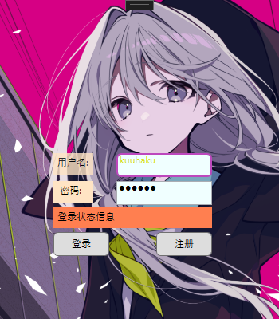
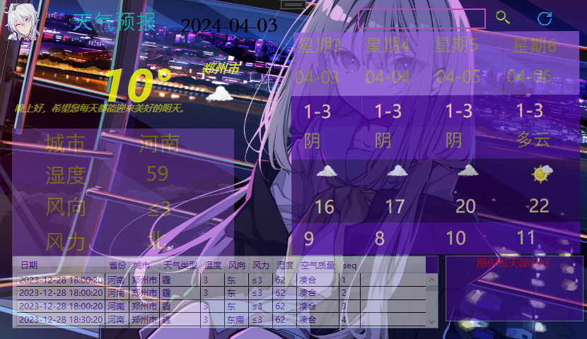
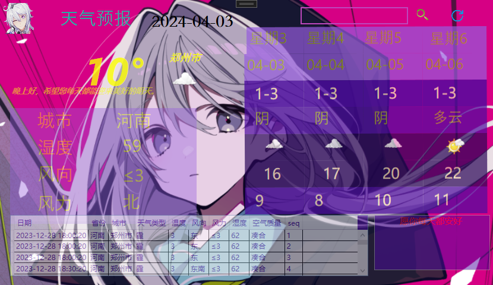
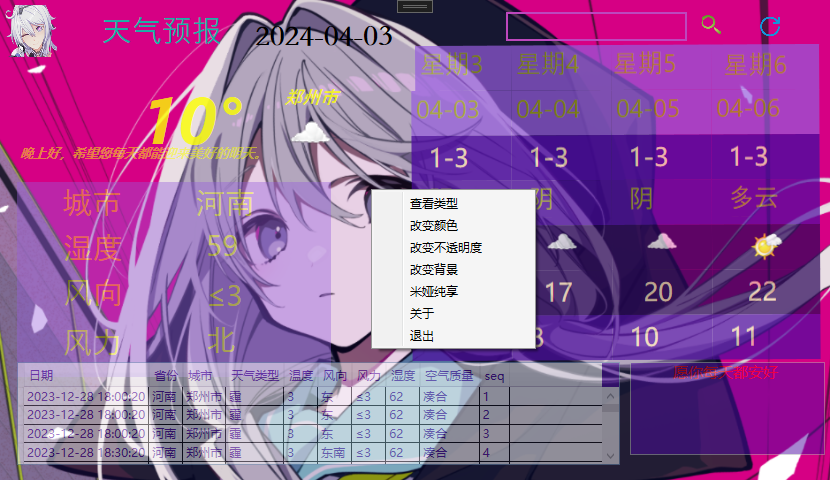

# WeatherReport
## 运行须知

1、项目开发环境为VS 2022 及 LocalDB 2019，请尽可能使用对应版本启动

2、因为涉及联网操作，所以在登录成功后可能需要等一会网络连接，反应可能比较慢

3、项目所有图片均以相对路径使用，已包含在项目根目录中

4、程序运行默认显示河南郑州的信息，查询失败默认显示北京，因此数据库中北京的信息数量会比较多

5、初次查找城市时会出现一条错误信息(窗口右下角)，因为初次查找时数据库没有对应表，需要执行建表操作 

   第二次查找该城市或点击刷新按钮即可正常显示显示上一次查询的表信息

6、为了项目整体美观，做了很多个性化内容，同时，也提供了最大化的自定义功能，如果觉得界面看不清等，可以通过右键菜单随意更改

### 项目简介

该项目旨在以网络连接的形式实时显示天气预报信息，数据来源为高德地图天气预报API(免费账号，每天查询次数为5k次，默认预报信息为4天)，

默认显示为郑州市天气预报情况，提供搜索功能，可以通过搜索查看想要查询的城市的天气情况，理论上我国领土内的都能查得到。

项目为原创且纯手工开发，思路灵感来自于Qt开发经验。

项目实现的小功能挺好玩的，希望能够正常运行程序，然后多尝试**右键菜单**功能

## 项目功能

1、提供登录验证功能，需要输入正确的用户名和密码方可登录，密码存储时使用了MD5加密。

2、提供关键字搜索功能，支持模糊搜索。

3、提供刷新功能，点击刷新按钮可重新获取当前城市信息。

4、项目中很多操作糅合在了鼠标右键菜单中，需要退出是也可点击鼠标右键菜单完成

5、登录窗口右键菜单提供：

​		关于：默认账号密码，可以用此登录

​		退出：点击关闭程序

6、主窗口右键菜单提供：

​		查看类型：查看所有天气类型对应图片，提供白天和晚上两个版本，通过下拉框选择不同的天气类型，窗口内会显示其对应的图片

​		改变颜色：如果角色字体颜色不够清晰可以自行更改，弹出颜色对话框自定义选取

​		改变不透明度：如果觉得字体看不清楚可以自行更改，下拉框选择，从0.1~1之间，窗口内有一个带颜色的控件供查看效果使用

​		改变背景：能够让主体背景在两个米娅之间切换，支持试用，在点击改变背景后会启动计时器，5s后弹出对话框询问是否保留当前背景，是则保留，否则返回原背景

​		隐藏背景：一键隐藏窗口内所有控件，只留下背景图

​		关于：项目组成员介绍

​		退出：退出程序

7、窗口(登录窗口和主窗口)都做了隐藏边框处理，并且重写了鼠标事件，无法更改大小，可以鼠标左键按下然后拖着窗口移动。

8、项目内部提供两种加密方式：MD5加密和OpenSSL加密，没有选用C#自带的RSA加密是因为C#自带的RSA加密库是公钥加密私钥解密，

   OpenSSL是私钥加密公钥解密，为了可移植性加密方式还是选用OpenSSL，然后使用一个工具类来进行对应的转换工作，

   但是，项目中仅提供相应接口，并没有实际使用，因为密码加密并不是主要功能，仅为以后二开以及连接服务器做准备。

#### 其他相关介绍

1、数据库介绍：项目一共用到两个数据库：

​		记录登录用户信息的数据库：仅提供一张表，记载用户名和密码，其中密码以MD5加密形式存放，使用了ADO .NET实体数据模型。

​		记录对应城市当日天气情况的数据库：每一张表对应一个城市，当执行查询操作后，如果该城市对应的表存在，会向表中插入一条数据，

​		如果表不存在，会创建一张新表。通过连接字符串直接对数据库进行操作。

2、关于天气信息来源：天气预报信息来源于高德地图天气API，理论上知道国内有的都可以搜得到，数据截至至2023年(也就是最新的)，账号是我的个人账号，预报信息默认提供4天。

3、窗口背景角色名为米娅，来自《Loopers》

## 运行效果

[登录界面]

[主界面]

[右键菜单]

<u>Origin: kuuhaku</u>
